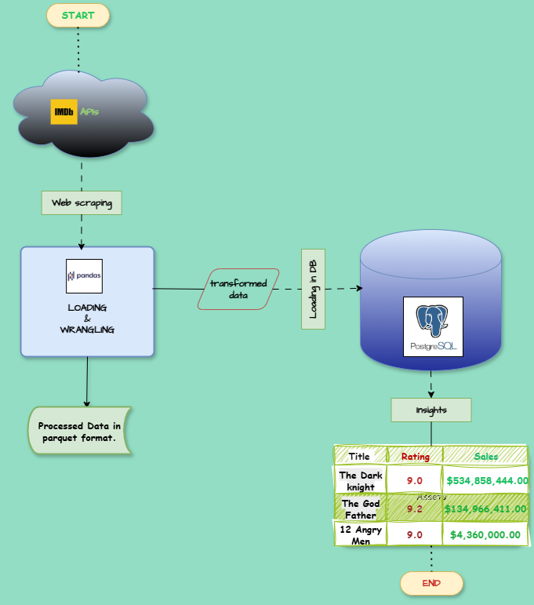
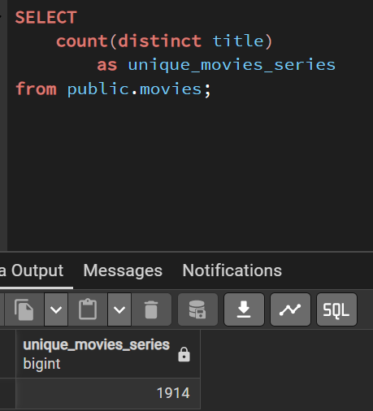
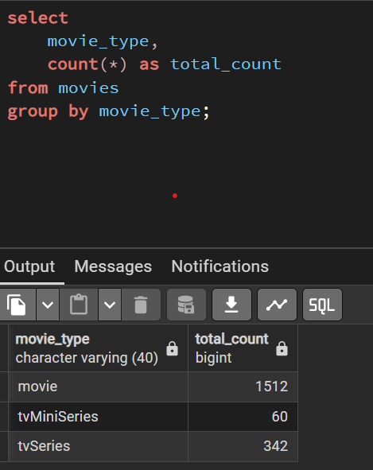
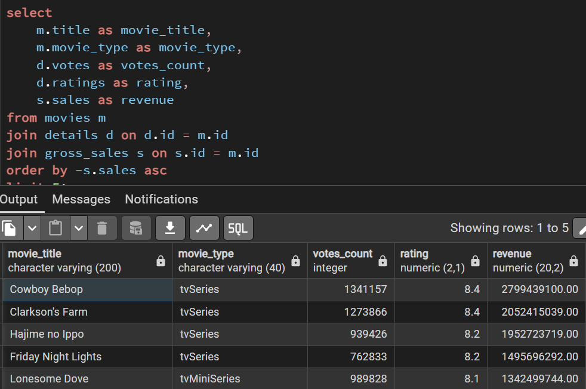
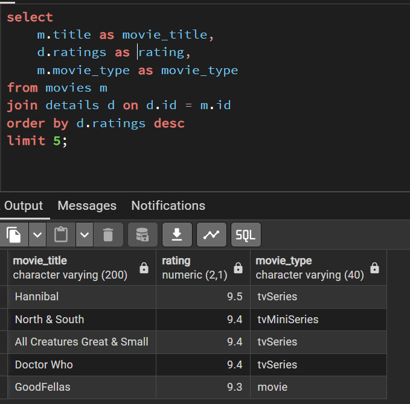
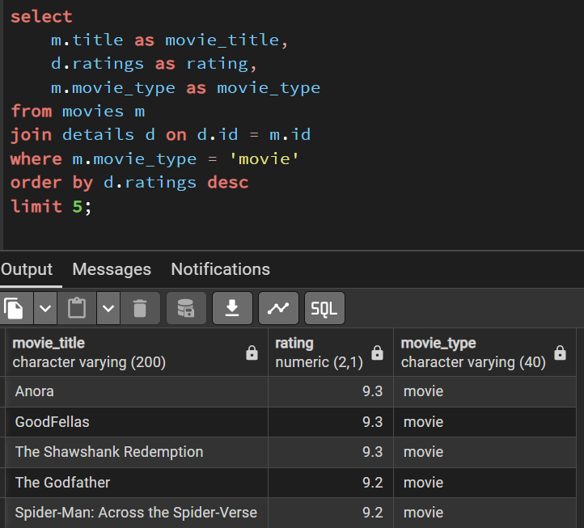

#  Arowosegbe Victor Iyanuoluwa ETL Pipeline

## Overview
The beginning of every data project is the data itself. As a data engineer, one of the crucial tasks that must be mastered is getting the right data in the right volume and ensuring consistent access to quality data. Data Scraping is a primary modality of sourcing for data which can be from websites, APIs and databases. This particular project  is basically an ETL (extract, transform and load) one where movies data were scraped from IMDb APIs on Rapid API website {[text](https://rapidapi.com/)}. 
Movies data were extracted from two APIs. They were cleaned, transformed and joined using pandas library and idempotency was ensured. The transformed data was loaded into a PostgreSQL database using SQLAlchemy ORM while a copy was saved in parquet format locally.

IMDb APIs Links
1) [text](https://rapidapi.com/octopusteam-octopusteam-default/api/imdb236/playground/apiendpoint_a5de12e2-d269-44fb-8af7-6eb02982ee9e)
2) [text](https://rapidapi.com/robotfa-robotfa-default/api/imdb-top-1000-movies-series/playground/apiendpoint_b9c2303e-934a-4b85-a8aa-3fed7cb08fe5)


## Features
- Extract: Fetch movie data from the IMDB APIs on Rapid API website using `Requests` library
- Transform: Clean and transform the extracted data using `Pandas` for efficient processing. Polars will follow after.
- Database integration with `SQLAlchemy` and `psycopg2`
- Configuration management using `.env` files
- Unit testing with `pytest`


## ETL Process Map/Architecture


## Database Table Schema
.jpg>)

## Project Structure
```
/etl_pipeline
│── .env                # Environment variables
│── .gitignore          # Git ignore file
│── pyproject.toml      # Project dependencies and metadata
│── poetry.lock         # Dependency lock file
│── README.md           # Project documentation
├── run_pipeline.py      # run etl pipeline logic
│── etl_pipe/
│   ├── __init__.py     # Package initialization
│   ├── web_scraper.py      # Extraction logic
│   ├── data_transform.py    # Data transformation logic
│   ├── db_loader.py         # Load processed data into a database
│── tests/
│   ├── __init__.py     # Package initialization
│   ├── test_web_scraper.py # Unit tests for extraction
│   ├── test_data_transform.py # Unit tests for transformation
│   ├── test_db_loader.py    # Unit tests for loading
│── notebooks/
│   ├── scraped.ipynb    # Jupyter notebook summarizing the scraping elements.
│   ├── joined.ipynb    #  Jupyter notebook summarizing the transformation elements. 
```

## Result
### Count of Movies & Series


### Movie_types and counts


### Highest Grossing (All Movie types)


### Highest Rated (All Movie types)


### Highest Rated (Movies Only!!!)


## Installation
### Prerequisites
- Python 3.13+
- Poetry package manager

### Steps
1. Clone the repository:
   ```sh
   git clone https://github.com/Iyanuvicky22/victor-etl-pipeline.git
   cd etl_pipeline
   ```
2. Install dependencies:
   ```sh
   poetry install
   ```

## Usage
Run the ETL pipeline with:
```sh
python run_pipeline.py
         or
poetry run python run_pipeline.py
```

To run tests:
```sh
pytest
```

## Dependencies
- `pandas` (>=1.25.2,<2.0.0)
- `requests` (>=2.32.3,<3.0.0)
- `sqlalchemy` (>=2.0.39,<3.0.0)
- `psycopg2` (>=2.9.10,<3.0.0)
- `pyarrow` (>=19.0.1,<20.0.0)"
- `fastparquet` (>=2024.11.0,<2025.0.0)"

[tool.poetry.group.dev.dependencies]
- `black` = "^25.1.0"
- `dotenv` = "^0.9.9"

[tool.poetry.group.testing.dependencies]
- `pytest` = "^8.3.5"
- `pytest-cov` = "^6.1.0"


## Author
**Arowosegbe Victor Iyanuoluwa**
